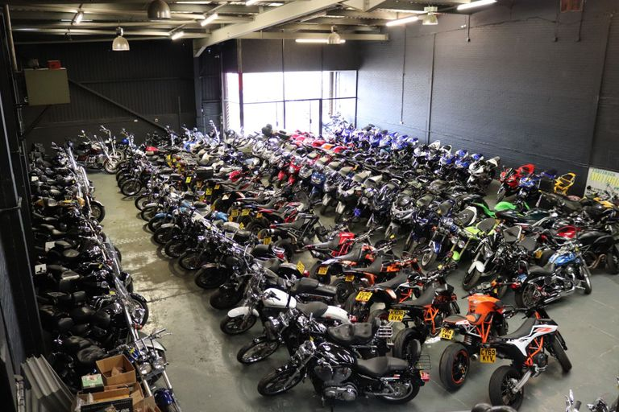

# Park-n-Ride Analysis

## Introduction:
**Park ‘n’ Ride** is an assumed  Store that sells Bike and Accessories through Resellers, across Europe, North America and Pacifics. It also allows direct Online purchase by Customers directly from the Store. The Reseller Business types ranges from  Warehousing, Value Added, Direct Sales and Speciality Bike Shop.

## Problem Statement:
Over time, the Store decides to review its business model of using Reseller vis a vis direct online Order by Customers, as well as its Profitability over a Four (4) Years  Financial cycle. This information will help them to rejig their business model in order to enhance their profitability.It will also afford them an holistic view across the entire Region of Operations.

## DataSet:
The assumed Raw DataSet is the Excel Sales file of  AdentureWorks 2019 provided by Oyinbooke.It contains Seven (7) Tables,namely:
1. Sales Order Data
2. Sales Territory Data
3. Sales Data
4. Reseller Data
5. Date Data
6. Product Data
7. Customer Data

## Skills Demonstrated:
Data Cleaning and Exploratory Skills were deployed to identify Rows and Columns that require cleaning,normalizing/Standardizing.Also two additional relationships were created using the Knowledge of Joining base on Primary and Foreign Key relationship that exist in the Tables.

## Data Transformation/Modelling:
Rows with missing values and wrong entry were identified. For example, In the Reseller Table,ResellerID Column has a row with value of [Not Applicable].This was normalized to AW00000000.Other Columns and Rows with [Not Applicable] were normalized to “Direct Sales” to reflect that the Reseller is an **Online Merchant** with a Virtual Address.

Reseller_dirty          |     Reseller_clean
:-----------------------|-----------------------:
 | 

Also in the Customer Table, CustomerID Column has a row with value of [Not Applicable].This was normalized to AW00010000. Other Columns and Rows with [Not Applicable] were normalized to “Direct Sales” to reflect that the **Online Customer** i.e the Customer order or make the purchase Online with a Virtual Address.

Customerer_dirty          |     Customer_clean
:-----------------------|-----------------------:
 | 

Thereafter two  new Relationships were created on the Sales table.First by joining the Sales Table with the Customer Table using the CustomerIDKey Column.Secondly the Sales table was joined with the Date Table using the DateKey Column.The two joins were executed using the  Primary /Foreign Key relationship that exist on the respective Tables. Unwanted Columns were removed and the Clean Dataset(7 Tables) were loaded into PowerBI for analysis.

Model_before            |     Model_after
:-----------------------|-----------------------:
   | 

## Analysis and Visualization:

The Analysis was done in Four(4)  broad Headers and relevant insight were generated accordingly.The Headers are :

1. ## Customers :

It analyses the Customer's Spending pattern,the Demography as well as the Yearly Order Trend. Eight (8) Insights were generated namely:
-  Number of Customers
-  Number of Order
-  Highest Spender
-  Lowest Spender
-  Customers spending by Country-Region
-  Number of Customer Order by Fiscal Year
-  Number of Customer Order by Fiscal Quarter
-  Customers spending by State Province Top(5)

2. ## Products:

It Analyses the Product range in terms of Price,Category and Sub Category. Five (5) Insights were created namely:
- Number of Products
- Cheapest Product
- Expensive Products
- Sales by Product Category
- Sales by Product Sub Category

3. ## Reseller:

It Analyse the performance of the Resellers in their region of Operations and individual contribution to the Business for the Period under review.
Five (5) Insights were created namely:
- Number of Resellers
- Reseller Sales by Business Types
- Top(5) Reseller by Sales
- Top(5) Reseller Sales by State-Province
- Reseller Sales by Country-Region

